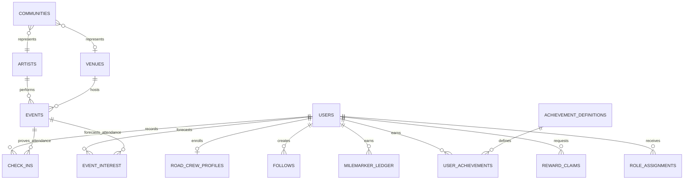

# FrontRow Architecture

## Product Boundary

FrontRow is the live entertainment platform. Road Crew is FrontRow's loyalty and engagement program.

```text
FrontRow
├── Identity
├── Artists
├── Venues
├── Events
├── Communities
└── Road Crew
    ├── Milemarkers
    ├── Status
    ├── Rewards
    ├── Achievements
    ├── Referrals
    └── Check-Ins
```

Endless Detour is the founding artist community, not the platform boundary.

## Entity Relationship Diagram



## Compatibility Strategy

- Keep `users` as the existing FrontRow identity and leaderboard-compatible summary record.
- Add `roadCrewProfiles` for Road Crew enrollment and status summaries.
- Add `milemarkerLedger` for idempotent award history and scoped reporting.
- Continue using `rewards` as the existing reward-claim collection.
- Add `platformId`, `communityId`, `artistId`, `venueId`, and `eventId` context incrementally.
- Default older unscoped records to `community-endless-detour` only during compatibility reads or migration.
- Never delete or reset legacy totals during migration.

## Award Flow

The transitional client records both the legacy total and the new Road Crew profile/ledger entry. The target production flow is:

```text
Verified activity or admin approval
  -> trusted Firebase Function
  -> idempotency check using type + referenceId
  -> update users compatibility summary
  -> update roadCrewProfiles summary
  -> create milemarkerLedger entry
  -> evaluate achievements and notifications
```

## Migration Order

1. Deploy additive Firestore rules and indexes.
2. Seed the founding community and achievement definitions.
3. Run `npm run migrate:frontrow` and review the dry-run counts.
4. Run `npm run migrate:frontrow:apply`.
5. Verify member totals, reward claims, check-ins, and event reports.
6. Install and deploy the Firebase Functions foundation.
7. Gradually route automatic awards through trusted Functions.
8. Tighten legacy client-write rules only after all clients use Functions.

## Future Multi-Artist Expansion

- Artist and venue follows remain independent of Road Crew enrollment.
- Communities may represent an artist, venue, festival, or promoter.
- Road Crew achievements may be platform-wide, program-wide, community-specific, or artist-specific.
- Scoped role assignments allow platform admins, artist managers, venue managers, and community moderators without relying on one global `isAdmin` flag.
- Event and ledger scope fields support cross-artist discovery, venue analytics, and community-specific loyalty reporting.
